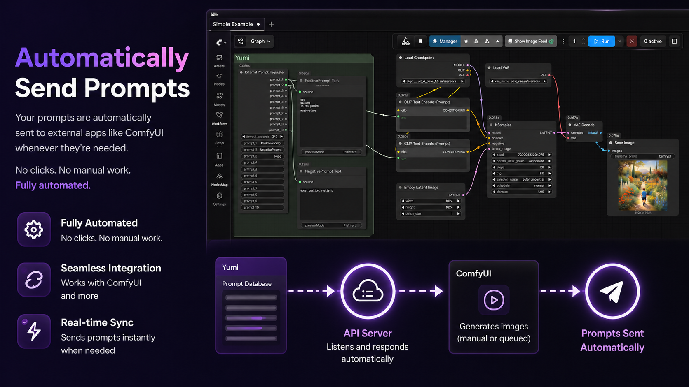

# comfyui-yumil-mpm

[English](README.md) | 日本語

[Yumil MPM](https://github.com/maigonia/YumilMPM) と連携するための [ComfyUI](https://github.com/comfyanonymous/ComfyUI) カスタムノード集です。Yumil MPM で管理・生成したプロンプトを ComfyUI のワークフローへ取り込み、プロンプト内に埋め込んだ画像パスやパラメータも扱えるようにします。

## 必要なもの

- [ComfyUI](https://github.com/comfyanonymous/ComfyUI)
- [Yumil MPM](https://github.com/maigonia/YumilMPM)

## インストール

### ComfyUI Manager（推奨）

ComfyUI Manager で `comfyui-yumil-mpm` と検索してインストールしてください。インストール後、ComfyUI を再起動してください。

### 手動インストール

または、ComfyUI の `custom_nodes` フォルダにこのリポジトリを clone してください。

```bash
cd ComfyUI/custom_nodes
git clone https://github.com/maigonia/comfyui-yumil-mpm.git
cd comfyui-yumil-mpm
pip install -r requirements.txt
```

インストール後、ComfyUI を再起動してください。

## 参考ワークフロー

ComfyUI 用の参考ワークフローを [`workflow`](workflow) フォルダに同梱しています。



- [`Simple Example.json`](workflow/Simple%20Example.json): Yumil MPM から Positive / Negative プロンプトを取得する最小構成の例です。
- [`Simple Text To Image With Yumil MPM.json`](workflow/Simple%20Text%20To%20Image%20With%20Yumil%20MPM.json): Yumil MPM のプロンプトカテゴリを使う Text to Image ワークフローです。
- [`Controlnet With Yumil MPM.json`](workflow/Controlnet%20With%20Yumil%20MPM.json): パーサー形式のプロンプトデータを使う ControlNet ワークフロー例です。
- [`Regional Prompt With Yumil MPM.json`](workflow/Regional%20Prompt%20With%20Yumil%20MPM.json): Attention Couple と Yumil MPM のカテゴリ別プロンプトを組み合わせた領域指定プロンプトのワークフローです。（[詳しい使い方](https://civitai.com/articles/30276/super-fast-regional-prompt-setup-with-yumil-mpm)）
- [`Mask And Pose Tags Creator.json`](workflow/Mask%20And%20Pose%20Tags%20Creator.json): 領域指定プロンプトで使うマスク / ポーズタグ用データを作成するためのワークフローです。

一部のワークフローでは追加の ComfyUI カスタムノードやモデルファイルが必要です。必要な拡張機能やモデルは、各ワークフロー内のメモを確認してください。

## ノード一覧

### External Prompt Requester

**カテゴリ:** `Yumil/API`

Yumil MPM にプロンプト生成をリクエストします。Yumil MPM 側で On-Demand Generation が有効な間、このノードをワークフローが通過するたびに Yumil MPM へ生成リクエストを送り、生成されたプロンプトを受け取ります。最大10個のカテゴリ名を指定できます。

**セットアップ:**

1. Yumil MPM を起動します。
2. Generation パネルの **Demand** ボタンを押して On-Demand Generation を有効にします。
3. Yumil MPM の API Server を有効にし、API key が生成されていることを確認します。

**入力:**

- `timeout_seconds`: リクエストのタイムアウト秒数。5から600まで指定できます。デフォルトは `240` です。
- `prompt_1` から `prompt_10`: プロンプトを取得したいカテゴリ名。

**出力:**

- `prompt_1` から `prompt_10`: 各カテゴリで生成されたプロンプト。

### Yumil Prompt Parser

**カテゴリ:** `Yumil/Prompt`

以下の形式のブロックを含むプロンプトを解析します。

```text
###_Path(...).Value(...).Text(...)_###
```

各要素は省略できます。

- `Path(...)`: カンマ区切りで複数のファイルパスを指定できます。画像以外のパスも扱えます。
- `Value(...)`: `strength=0.8,mode=ipadapter` のような `key=value` パラメータを指定できます。
- `Text(...)`: プロンプト本文です。`Text(...)` があるブロックは clean text 内でその本文に置き換えられ、`Text(...)` がないブロックは clean text から取り除かれます。

**主な用途:**

- プロンプト内に埋め込んだ参照画像パスを取り出す。
- ControlNet や IPAdapter などに渡すパラメータをプロンプトと一緒に管理する。
- テキスト、ファイルパス、パラメータをひとつのプロンプト文字列として扱う。

**例:**

```text
###_Path(img0.png,img1.png).Value(strength=0.8,mode=ipadapter).Text(hello)_###
###_Path(img.png).Text(hello)_###
###_Path(img.png)_###
###_Value(mode=test).Text(hello)_###
```

**入力:**

- `prompt`: パーサーブロックを含む可能性のあるプロンプト文字列。

**出力:**

- `clean_text`: ブロックが置換または削除されたプロンプト。
- `block_count`: 検出されたブロック数。
- `PARSED_DATA`: 後続ノードで使うための構造化データ。

### Yumil Block Selector

**カテゴリ:** `Yumil/Block`

Yumil Prompt Parser の `PARSED_DATA` から、指定したインデックスのブロックを1つ取り出します。複数のブロックを使いたい場合は、このノードを複数配置して別々の `index` を指定してください。

**入力:**

- `parsed_data`: Yumil Prompt Parser から接続します。
- `index`: 取り出すブロックのインデックス。0始まりです。

**出力:**

- `path_0` から `path_3`: `Path(...)` 内の個別パス。
- `path_count`: 選択したブロック内のパス数。
- `value`: `key=value` パラメータ文字列。
- `text`: 関連するテキスト。

### Yumil Image Loader

**カテゴリ:** `Yumil/Image`

ファイルパスから画像を1枚読み込み、ComfyUI の `IMAGE` テンソルに変換します。Yumil Block Selector のパス出力、または任意の文字列パスを接続できます。

**入力:**

- `path`: 画像ファイルのパス。
- `resize_mode`: `disabled`, `stretch`, `crop_center`, `pad_white`。
- `target_total`: 幅と高さの合計目標値。SDXL なら `2048` など。`0` の場合はこの指定によるリサイズを行いません。
- `width` / `height` 任意: 明示的にサイズを指定します。

**出力:**

- `image`: 読み込まれた画像テンソル。
- `width` / `height`: 画像サイズ。

### Yumil Value Reader

**カテゴリ:** `Yumil/Block`

カンマ区切りの `key=value` 文字列から、指定したキーの値を取り出します。キーが見つからない場合はデフォルト値を返します。

**入力:**

- `value`: Yumil Block Selector からの `key=value` 文字列。
- `key`: 取得したいキー名。
- `default_value`: キーが見つからなかった場合に返す値。

**出力:**

- `result`: 指定キーの値。

### Yumil Lora Stripper

**カテゴリ:** `Yumil/Prompt`

テキストから `<lora:name:weight>` 形式の LoRA タグをすべて抽出し、本文から取り除きます。

**入力:**

- `text`: LoRA タグを含むテキスト。

**出力:**

- `text`: LoRA タグが取り除かれたテキスト。
- `loras`: 抽出された LoRA タグ。

### Yumil Prompt Lora Loader

**カテゴリ:** `Yumil/Loaders`

プロンプト中の `<lora:name:strength>` タグを解析し、該当する LoRA を `MODEL`（および任意で `CLIP`）に適用したうえで、`strip_tags` が `true` の場合はタグを取り除いたプロンプトを返します。

LoRA ファイル名は `folder_paths.get_filename_list("loras")` に対して 7 段階のファジー一致（完全一致 → 拡張子なし → ベース名 → ベース名（拡張子なし）→ 部分一致）で解決するため、プロンプト側でファイル名を多少省略していても通常は正しくマッチします。`<lora:name:-0.3>` のような負の strength も使えます。strength が `0` の場合や名前が解決できなかったタグはエラーにせずログを残してスキップします。

`clip` は任意入力です。未接続の場合、LoRA は MODEL のみに適用されます（CLIP 強度は内部的に `0` として扱われます）。これにより、CLIP を取り扱わない LTXV などのパイプラインでも利用できます。

**入力:**

- `model` (MODEL, 必須): LoRA を適用する対象のモデル。
- `prompt` (STRING, 複数行, 必須): `<lora:...>` タグを含む可能性のあるプロンプト。
- `strip_tags` (BOOLEAN, 必須, デフォルト `true`): `true` の場合、出力 `TEXT` から `<lora:...>` タグが取り除かれます。
- `clip` (CLIP, 任意): 接続した場合、LoRA の strength が CLIP にも適用されます。

**出力:**

- `MODEL`: マッチした LoRA がすべて適用された MODEL。
- `CLIP`: LoRA が適用された CLIP（`clip` 未接続の場合は `None`）。
- `TEXT`: `strip_tags` が `true` のときは `<lora:...>` タグを取り除いたプロンプト、`false` のときは元のプロンプト。

### Yumil Text Join

**カテゴリ:** `Yumil/Prompt`

最大7つのテキスト入力を、指定した区切り文字で結合します。空の入力はスキップされます。

**入力:**

- `delimiter`: 区切り文字。デフォルトは `, ` です。
- `text_0` から `text_6`: 結合するテキスト。

**出力:**

- `text`: 結合結果。

### Yumil Batch Save

**カテゴリ:** `Yumil/IO`

最大6枚の画像を JPEG として保存し、任意でテキストファイルも同じフォルダに保存します。

**入力:**

- `parent_folder`: 出力先ディレクトリ。
- `folder_name`: 作成するサブフォルダ名。ファイル名のプレフィックスとしても使われます。
- `text` 任意: `{folder_name}.txt` として保存されます。
- `image_0` から `image_5`: `{folder_name}_0.jpg` のように保存されます。

## テスト

```bash
python -m pytest tests -v --rootdir=tests --import-mode=importlib -p no:cacheprovider --ignore-glob="*pytest-cache-files-*"
```

## リンク

- [Yumil MPM](https://github.com/maigonia/YumilMPM)
- [ComfyUI](https://github.com/comfyanonymous/ComfyUI)
- [X (@YumilMpm)](https://x.com/YumilMpm)

## クレジット

- **Yumil Prompt Lora Loader** は [rgthree-comfy](https://github.com/rgthree/rgthree-comfy)（MIT License, Copyright (c) 2023 Regis Gaughan, III）の LoRA タグ正規表現とファジーファイル名マッチング処理を流用しています。詳細は [`LICENSE`](LICENSE) の Third-Party Notices を参照してください。

## ライセンス

[MIT](LICENSE)
